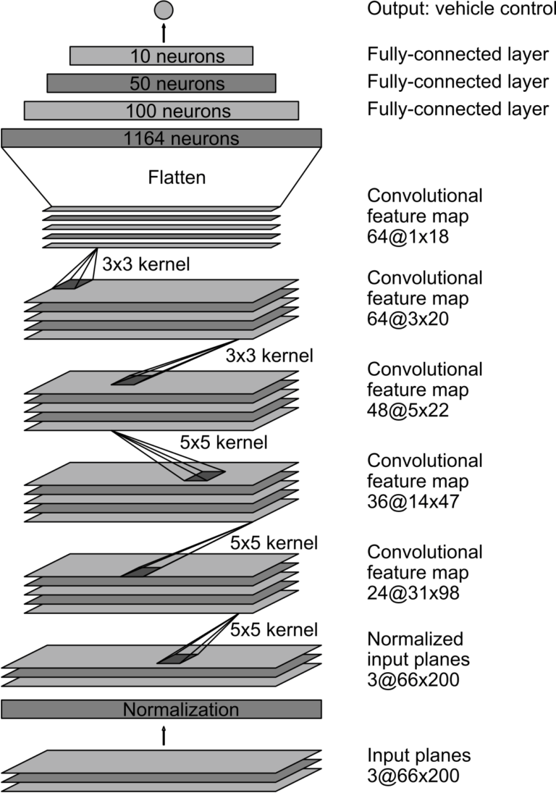
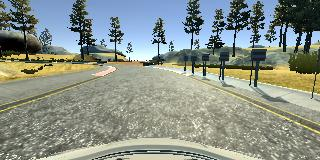

# Behaviorial Cloning Project

Overview
---
This repository contains the results files for the Behavioral Cloning Project.

The goals of the project is to use what I've learned about deep neural networks and convolutional neural networks to clone driving behavior. I will train, validate and test a model using Keras. The model will output a steering angle to an autonomous vehicle.

With simulator I steer a car around a track for data collection that will be used to train the model and then use it to drive the car autonomously around the track.

**Behavioral Cloning Project**

The goals / steps of this project are the following:
* Use the simulator to collect data of good driving behavior
* Build, a convolution neural network in Keras that predicts steering angles from images
* Train and validate the model with a training and validation set
* Test that the model successfully drives around track one without leaving the road
* Summarize the results with a written report

### Dependencies
This lab requires:

* [CarND Term1 Starter Kit](https://github.com/udacity/CarND-Term1-Starter-Kit)

The lab enviroment can be created with CarND Term1 Starter Kit. Click [here](https://github.com/udacity/CarND-Term1-Starter-Kit/blob/master/README.md) for the details.

The following resources can be found in this github repository:
* drive.py
* video.py
* writeup_template.md

The simulator can be downloaded from the classroom. In the classroom, we have also provided sample data that you can optionally use to help train your model.

### Collecting data

For collect the ground truth of the project we use the simulator, we have train several
situations, along the project we collect some data. The steps was:

1. Normal 1 lap to main circuit.
2. 2 additional labs to get more information
3. 2 laps in clockwise direction
4. some small records to parts of the circuit where the driving fails like:
  * bridge, from the sides to recover the center.
  * in the sand exit, looks like the car likes the fields.
  * last curve, the car likes to swim.

### Processing dataset

For a better performance of the nets I have:

1. Removed, as suggested, the top of the images and the bottom.
2. Normalized the images adding a layer to the network that transform the values 0-255 to a range of -0.5 to 0.5
  ` Lambda(lambda x:x/255.0 - 0.5,input_shape=(160,320,3)`
3. Manipulate the original dataset to normalize the distribution of the steering well

Originally the distribution of the data was:

[image1]: ./initialLabels.png "Initial data"
![Original Angles][image1]

In this histogram we can see a hi unbalance data between 0 and the other possibilities.
To avoid this situation I've removed some of the 0angel images.

After removing the 0's the situation was:

[image2]: ./reduce0s.png "Initial data"
![Removing zeros][image2]

As we can see in this distribution it is unbalanced left. So we introduce Mirroring, with
this results

[image3]: ./symmetric.png "Initial data"
![Flipping images][image3]

We still seeing a bit of unbalanced left distribution, so we drive in clockwise direction

[image4]: ./clock-wise.png "Initial data"
![clockwise driving][image4]

In a second stage I repeat the training but using the mouse, with the mouse the movements
are smoother but there is less zeros, so I cut values between -0.04 and 0.04.

### Data augmentation

To obtain additional data we have use several ideas.

1. I have used both lateral cameras to have the tendency to correct the path in order to
go to the center. We have test several times with a very simple network to train quick
different angles, as bigger is the correction faster and uncontrolled is the answers
2. Mirroring all images and inverting the steering angels to augment situations and data.

### Neural Network  Architecture.

Initially we use a single dense layer with 128 neurons to test quick, but it is very
inefficient running out everitime.

After that I've try a convolutional network this architecture.

| Layer | Params |
|---|---|
|Conv2D | kernel(6,6) deep 6, acctivation relu |
|Conv2D | kernel(6,6) deep 6, acctivation relu |
|MaxPool2D | |
| Dropout 20%||
|Flatten||
| Dropout 20%||
|Dense |128 neurons|
| Dropout 20%||
|Dense |84 neurons|
| Dropout 20%||
|Dense |1 neurons|

It works!!! But only in one direction, in clockwise. In anticlockwise, the default direction, the car miss the intersection and goes by the sand road. The recorded images can [see it here](https://github.com/mquinteiro/CarND-Behavioral-Cloning-P3/blob/master/CCMFdDdDdD-I.mp4)

I can do tree tactics to avoid the problem.
Try to make more epochs (it doesn't work), make more training data with this information,
of change the network.

My first try was add an additional convolution layer, and it works, but just one time, so it is not strong enough!

Next steeps was to try different combinations of the convolutional layers with different
dropouts,

The last try has [NVidea model proposed here](https://devblogs.nvidia.com/parallelforall/deep-learning-self-driving-cars/)

The architecture as presented by NVidia is:

Both networks have similar behavior, and both fails in similar places.

To solve I've do more training.

Because PC limitations I've do different batches of images and train in blocks.

Also I have selected some images that shows how the model will fit.

